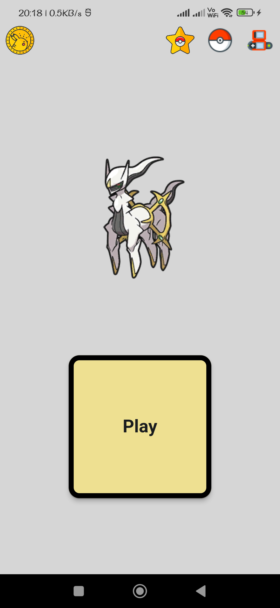
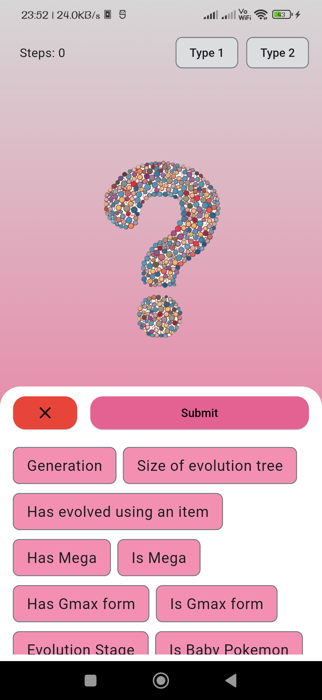
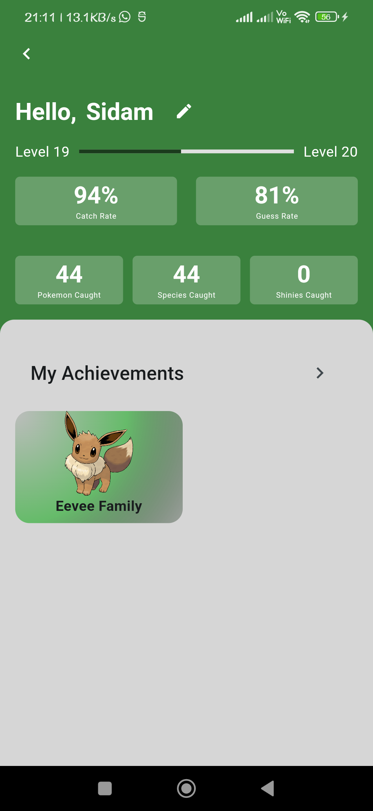
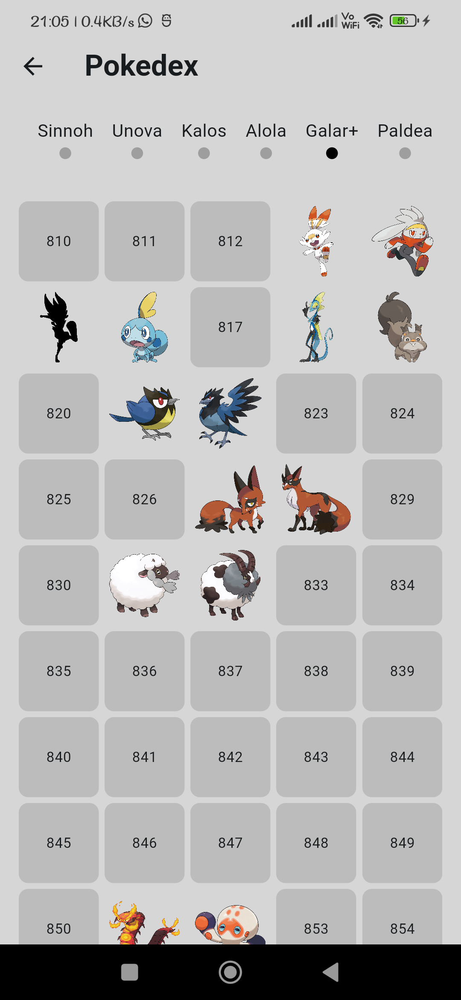
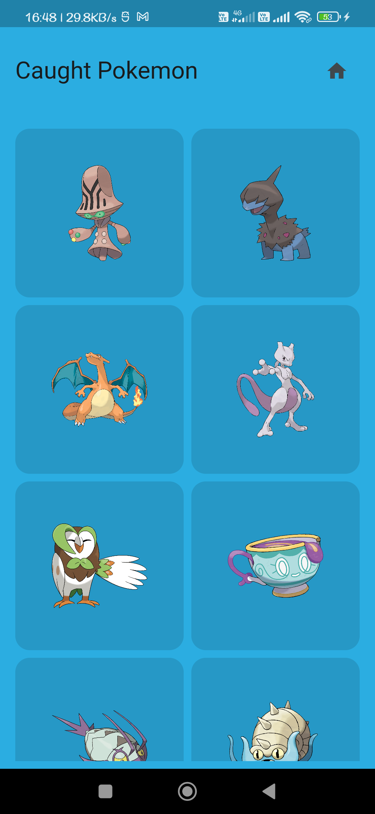
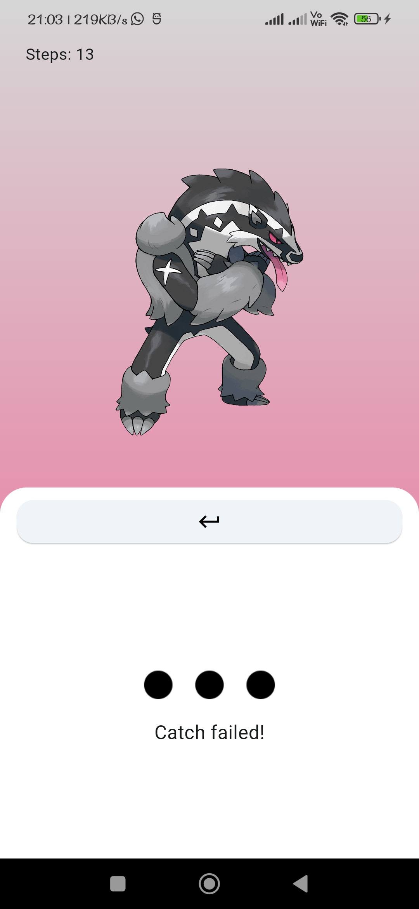
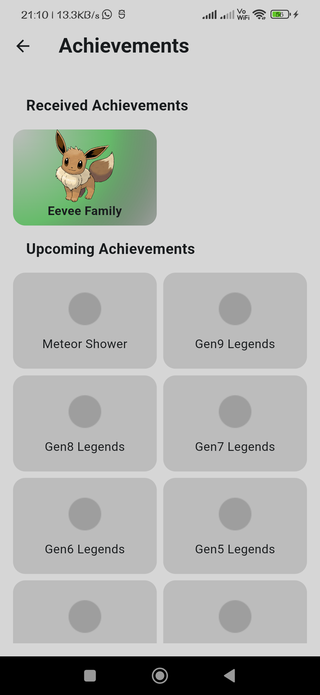

# Pokemon Guessing Game

Welcome to the Pokemon Guessing Game! This is a fun and challenging game where you have to guess a randomly selected Pokemon by answering a series of questions. The game provides no clues, making it a true test of your Pokemon knowledge.

Note: I know that the UI is bad. Please give me ideas, I really need them. I also have some ideas, so I will apply them in a while.

## Images
       

## How to Play

1. The game will randomly select a Pokemon from the database.
2. You will be presented with various questions related to the Pokemon, such as its type, abilities, or characteristics with their respective options.
3. Choose the option that you think best describes the Pokemon.
4. Continue answering the questions until you correctly guess the Pokemon.

## Features

- Random Pokemon selection from a comprehensive database.
- Multiple-choice questions with various options related to the Pokemon's type, and other characteristics.
- Catching Pokemon after succesful guess.
- Catching a collection of pokemon can get you an achievement.
- A profile where user can view their stats and achievements.
- A pokedex where user can see individual stats about their caught pokemons.

## Features to be implemented
- A OG Silhouette "Who's that pokemon" mode.
- Score tracking and high score leaderboard will maybe be implemented.

## Contributing

Contributions to the Pokemon Guessing Game project are welcome! If you find any issues or have suggestions for improvements, please open an issue or submit a pull request.

## Acknowledgments

- [Pokemon API](https://pokeapi.co/) for providing the Pokemon data.
- [Bulbapedia](https://bulbapedia.bulbagarden.net/wiki/Main_Page) for the high quality images used through HybridShivam's repository.
- [HypridShivam's Pokemon Assets Repository](https://github.com/HybridShivam/pokemon) for providing images. (Main repo used to images is forked from this repo)
- Flutter and Dart communities for their support and resources.

## Copyright Notice
This is an unofficial, non-commercial, fan-made game and is NOT affiliated, endorsed or supported by Nintendo, Game Freak and The Pokémon Company in any way. Many images used in this app are copyrighted and are supported under fair use. Pokémon and Pokémon character names are trademarks of Nintendo. No copyright infringement intended.
