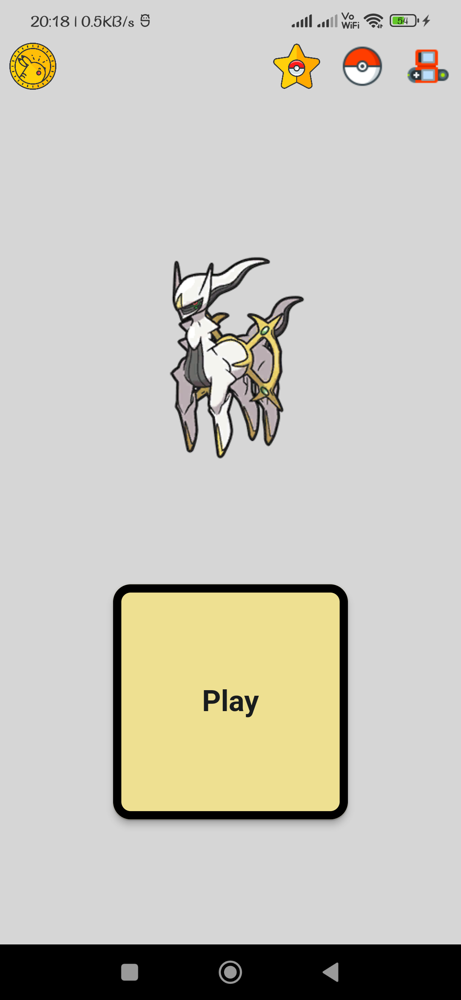
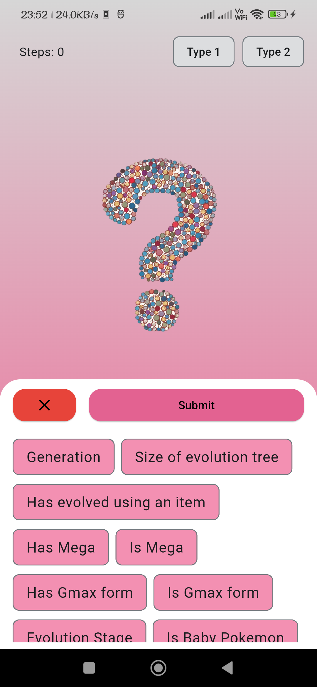
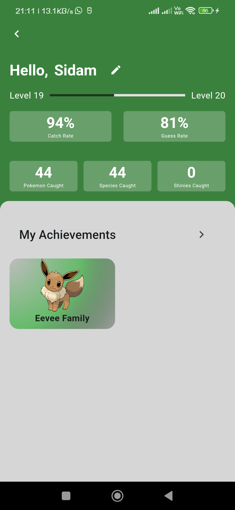
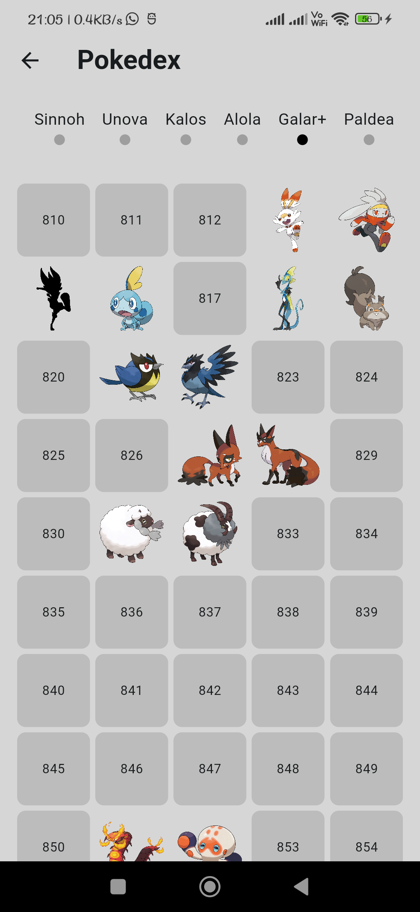
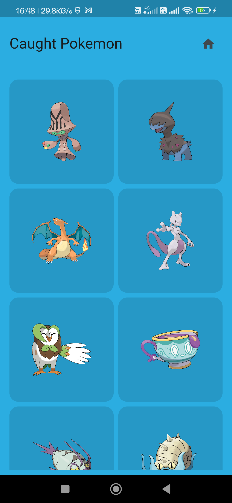
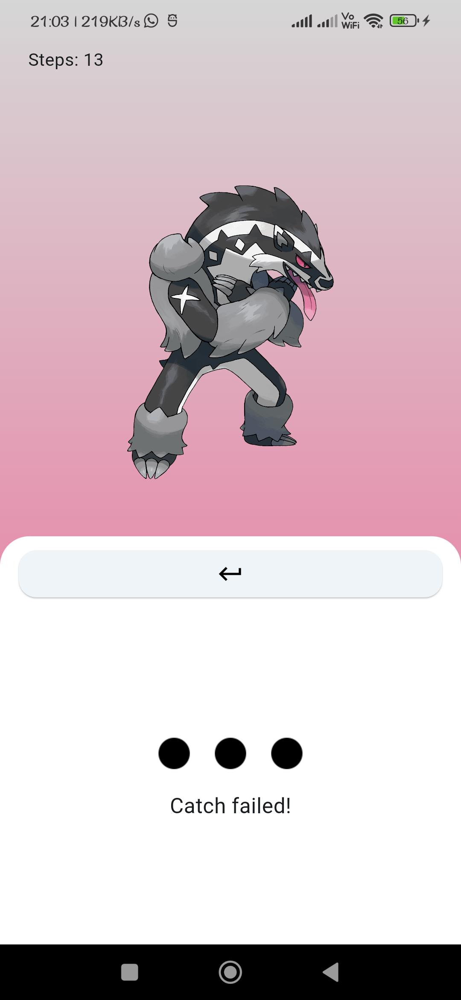
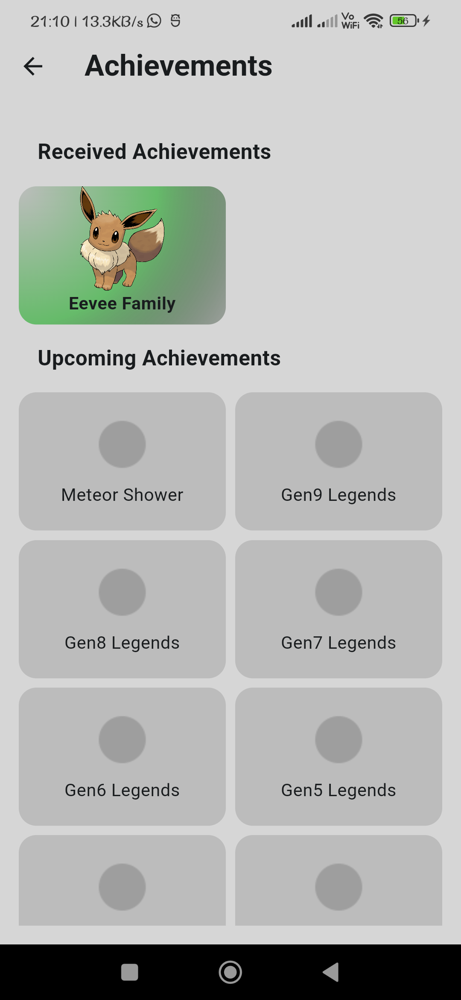

# Pokemon Guessing Game

Welcome to Guess The Gyarados! Each round, the game secretly picks a random Pokémon (national dex #1–1025) and hides its sprite behind a "Who's that Pokémon?" silhouette. You have to name it yourself — the game gives you nothing for free, but you can spend **steps** to buy hints about the mystery Pokémon's traits, at the cost of a lower catch rate once you get it right.

Note: I know that the UI is bad. Please give me ideas, I really need them. I also have some ideas, so I will apply them in a while.

## Images
       

## How to Play

1. The game randomly picks a Pokémon and shows its two elemental types plus a row of unrevealed clue chips (Generation, Evolution tree size, Evolution stage, whether it evolves with an item, has/is a Mega or Gmax form, is a baby/Legendary/Mythical/Starter/Pseudo-legendary).
2. Tap any clue chip to spend a **step**:
   - **Yes/No traits** (Mega, Gmax, Legendary, Mythical, Baby, Starter, Pseudo-legendary, item-evolution) reveal instantly — there's nothing to guess, so the step is just the cost of asking.
   - **Multi-option traits** (type, generation, evolution-tree size, evolution stage) open a picker instead. Every option you try costs a step, and the chip only reveals the real value once you pick the correct one — wrong picks just burn a step and let you try again.
3. When you think you know the Pokémon, tap **SUBMIT** to search the full 1025-name Pokédex list and pick your answer. Each submission attempt also costs a step, whether right or wrong.
4. Guessing the name correctly swaps the silhouette for the real sprite and starts the catch attempt (see below). Tapping the close button instead gives up on the round — the Pokémon "runs away," recorded as a missed encounter, and you still earn a small consolation reward for the steps spent.

## Catch Logic

Every step you burn on hints/guesses lowers your odds of actually catching the Pokémon once you name it correctly:

- Base catch rate starts at **100% − (steps × 0.5%)**.
- The rate is **halved** if the Pokémon is Legendary or Mythical.
- It's further reduced by **5%** if the Pokémon is in its 2nd evolution stage, or **10%** if in its 3rd/final stage.
- Arceus is a special case: its catch rate is always pinned to **1%**, no matter how few steps you used.
- A random roll then decides success. Catching it awards points equal to the Pokémon's base stat total (BST) — **doubled** if you rolled a shiny (a 1-in-1000 chance each round). A failed catch attempt still awards **half the BST** in points, and giving up early awards `(BST ÷ 100) × steps` points.

## Features

- Random Pokémon selection (including a rare shiny variant) from a comprehensive PokeAPI-backed database.
- A step-based hint system: yes/no reveals and multiple-choice pickers for type, generation, evolution stage/tree size, and special forms.
- A name-guessing search over the full Pokédex, with a catch attempt (and catch-rate math) once you're right.
- Catching Pokémon builds up a personal Pokédex and can unlock achievements for collecting sets of catches.
- A profile where the user can view their level, points, and earned achievements.
- A pokedex where the user can see individual stats about their caught Pokémon.

## Features to be implemented
- Score tracking and high score leaderboard will maybe be implemented.

## Contributing

Contributions to the Pokemon Guessing Game project are welcome! If you find any issues or have suggestions for improvements, please open an issue or submit a pull request.

## Acknowledgments

- [Pokemon API](https://pokeapi.co/) for providing the Pokemon data.
- [Bulbapedia](https://bulbapedia.bulbagarden.net/wiki/Main_Page) for the high quality images used through HybridShivam's repository.
- [HypridShivam's Pokemon Assets Repository](https://github.com/HybridShivam/pokemon) for providing images. (Main repo used to images is forked from this repo)
- Flutter and Dart communities for their support and resources.

## Copyright Notice
This is an unofficial, non-commercial, fan-made game and is NOT affiliated, endorsed or supported by Nintendo, Game Freak and The Pokémon Company in any way. Many images used in this app are copyrighted and are supported under fair use. Pokémon and Pokémon character names are trademarks of Nintendo. No copyright infringement intended.
