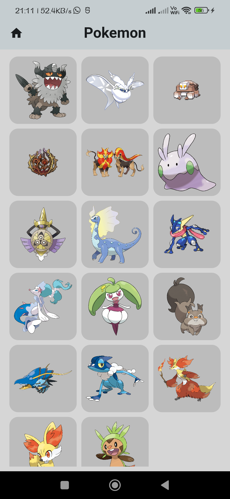

# Pokemon Guessing Game

Welcome to the Pokemon Guessing Game! This is a fun and challenging game where you have to guess a randomly selected Pokemon by answering a series of questions. The game provides no clues, making it a true test of your Pokemon knowledge.

   

## How to Play

1. The game will randomly select a Pokemon from the database.
2. You will be presented with various options related to the Pokemon, such as its type, abilities, or characteristics.
3. Choose the option that you think best describes the Pokemon.
4. Continue answering the questions until you correctly guess the Pokemon.

## Features

- Random Pokemon selection from a comprehensive database.
- Multiple-choice questions with various options related to the Pokemon's type, and other characteristics.
- A OG Silhouette "Who's that pokemon" mod (to be implemented).
- Catching Pokemon after succesful guess (to be implemented).
- Score tracking and high score leaderboard (will maybe be implemented).

## Getting Started

To run the Pokemon Guessing Game locally (would add release files later on), follow these steps:

1. Clone the repository: `https://github.com/ThisIsSidam/guess-the-gyarados`
2. Navigate to the project directory: `cd guess-the-gyarados`
3. Install the required dependencies: `flutter pub get`
4. Run the app: `flutter run`

## Contributing

Contributions to the Pokemon Guessing Game project are welcome! If you find any issues or have suggestions for improvements, please open an issue or submit a pull request.

## License

This project is licensed under the [GNU GPLv3](LICENSE).

## Acknowledgments

- [Pokemon API](https://pokeapi.co/) for providing the Pokemon data.
- Flutter and Dart communities for their support and resources.

Enjoy the game and Guess 'em all!
